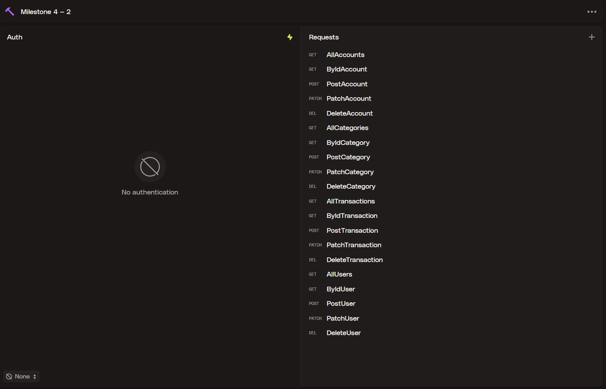

[](https://classroom.github.com/a/TLpjRxBx)

## Milestone 4

Dokumentasi backend untuk milestone 4 berisi categories, transactions, accounts, dan users.

### How to Run

```bash
pnpm install
pnpm dlx prisma migrate dev
pnpm run start:dev
```

### Deployed Backend

[](https://milestone-4-diba15-production.up.railway.app/)

### API Documentation

[](https://milestone-4-diba15-production.up.railway.app/api)

### Categories

| Field |         Type | Notes                 |
|-------|-------------:|-----------------------|
| id    |       number | unique                |
| name  |       string |                       |
| type  | categoryType | enum: income, expense |

### Transactions

| Field       |            Type | Notes                           |
|-------------|----------------:|---------------------------------|
| id          |          number | unique                          |
| accountId   |          number | FK ke Account.id                |
| categoryId  |          number | FK ke Category.id               |
| type        | transactionType | enum: income, expense, transfer |
| amount      |          number | jumlah desimal                  |
| description |          string |                                 |
| createdAt   |            Date | timestamp                       |

### Accounts

| Field     |        Type | Notes                      |
|-----------|------------:|----------------------------|
| id        |      number | unique                     |
| userId    |      number | FK ke User.id              |
| name      |      string | nama akun                  |
| type      | accountType | enum: cash, bank, e-wallet |
| balance   |      number | jumlah saat ini            |
| createdAt |        Date | timestamp                  |

### Users

| Field     |   Type | Notes             |
|-----------|-------:|-------------------|
| id        | number | unique            |
| name      | string |                   |
| email     | string |                   |
| password  | string | mock only         |
| role      |   role | enum: admin, user |
| createdAt |   Date | timestamp         |

### Enums

- role: admin, user
- accountType: cash, bank, e-wallet
- categoryType: income, expense
- transactionType: income, expense, transfer

### Endpoints



- Categories (prefix /categories)
    - POST /categories — body: CreateCategoryDto
    - GET /categories
    - GET /categories/:id — id: number (ParseIntPipe)
    - PATCH /categories/:id — body: UpdateCategoryDto
    - DELETE /categories/:id

- Transactions (prefix /transactions)
    - POST /transactions — body: CreateTransactionDto
    - GET /transactions
    - GET /transactions/:id — id: number
    - PATCH /transactions/:id — body: UpdateTransactionDto
    - DELETE /transactions/:id

- Users (prefix /users)
    - POST /users — body: CreateUserDto
    - GET /users
    - GET /users/:id — id: number
    - PATCH /users/:id — body: UpdateUserDto
    - DELETE /users/:id

- Accounts (prefix /accounts)
    - POST /accounts — body: CreateAccountDto
    - GET /accounts
    - GET /accounts/:id — id: number
    - PATCH /accounts/:id — body: UpdateAccountDto
    - DELETE /accounts/:id