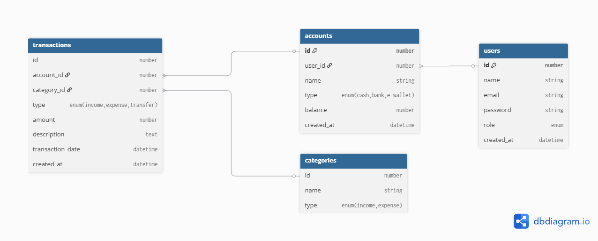

# Fintrack API - Milestone 4 & 5

Dokumentasi backend untuk Fintrack yang mencakup fitur pengelolaan Categories, Transactions, Accounts, Users, beserta
sistem Autentikasi dan Keamanan tingkat lanjut.

### Deployed Backend

[](https://milestone-4-diba15-production.up.railway.app/)

### API Documentation

[](https://milestone-4-diba15-production.up.railway.app/docs)

## 🚀 How to Run (Local Setup)

**1. Install Dependencies**

```bash
pnpm install
```

**2. Setup Environment Variables**

Buat file `.env` di root directory dan isi berdasarkan `.env.example`.

**3. Database Migration**

```bash
pnpm dlx prisma migrate dev
```

**4. Run Server**

```bash
pnpm run start:dev
```

## 🏗️ Arsitektur & Dependency Injection

Aplikasi ini dibangun menggunakan arsitektur modular NestJS dengan menerapkan prinsip **Repository Pattern** untuk
memisahkan logika akses database (Prisma) dari logika bisnis (Service).

**Custom Provider Implementation:**

Logika kalkulasi saldo saat pembuatan/perubahan/penghapusan transaksi dipisahkan secara murni ke dalam
`BalanceCalculatorService`. Service ini di-inject ke dalam `TransactionsService` menggunakan pendekatan **Custom
Provider** dengan string token (`@Inject('BALANCE_CALCULATOR')`).

> **Alasan arsitektural:** Memisahkan logika matematika murni dari ketergantungan framework/database sehingga lebih
> mudah di-unit test secara mandiri.

## 🛡️ Security & Hardening Features

Aplikasi ini dilengkapi perlindungan keamanan setara produksi:

- **Request Logging (Custom Middleware):** Mencatat setiap metode HTTP, path, status code, dan response time ke terminal
  untuk kebutuhan audit.
- **Authentication & Stateful JWT:** Menggunakan Passport-JWT. Token disimpan secara stateful (hash refresh token di DB)
  untuk memungkinkan fitur revoke/logout yang aman.
- **Per-User Data Ownership:** Setiap operasi Read/Update/Delete pada Accounts dan Transactions memvalidasi `userId`
  dari JWT. User A sama sekali tidak bisa mengakses/melihat data finansial User B.
- **Role-Based Access Control (RBAC):** Menerapkan kustom `@Roles()` decorator dan `RolesGuard`. Fitur administratif
  (seperti melihat seluruh data user) dikunci secara ketat.
- **Security Hardening:**
    - **Helmet.js:** Mengamankan aplikasi dari kerentanan web standar via HTTP headers.
    - **CORS:** Dibatasi secara eksplisit melalui `.env`.
    - **Rate Limiting (Throttler):** Mencegah serangan Brute Force, terutama pada endpoint `/auth/login` (maksimal 3
      request/menit per IP).
    - **Data Sanitization:** Password hash dibuang dari setiap response payload menggunakan Prisma `select`.

## 🗄️ Database Schema & ERD



### Categories (Master Data)

| Field | Type         | Notes                 |
|-------|--------------|-----------------------|
| id    | number       | unique                |
| name  | string       |                       |
| type  | categoryType | enum: income, expense |

### Transactions

| Field       | Type            | Notes                           |
|-------------|-----------------|---------------------------------|
| id          | number          | unique                          |
| accountId   | number          | FK ke Account.id                |
| categoryId  | number          | FK ke Category.id               |
| type        | transactionType | enum: income, expense, transfer |
| amount      | number          | jumlah desimal                  |
| description | string          |                                 |
| createdAt   | Date            | timestamp                       |

### Accounts

| Field     | Type        | Notes                      |
|-----------|-------------|----------------------------|
| id        | number      | unique                     |
| userId    | number      | FK ke User.id              |
| name      | string      | nama akun                  |
| type      | accountType | enum: cash, bank, e-wallet |
| balance   | number      | jumlah saat ini            |
| createdAt | Date        | timestamp                  |

### Users

| Field     | Type   | Notes             |
|-----------|--------|-------------------|
| id        | number | unique            |
| name      | string |                   |
| email     | string |                   |
| password  | string | Hashed via Bcrypt |
| role      | role   | enum: admin, user |
| createdAt | Date   | timestamp         |

### Enums

- `role`: admin, user
- `accountType`: cash, bank, e-wallet
- `categoryType`: income, expense
- `transactionType`: income, expense, transfer

## 📡 Endpoints

**Keterangan Ikon:**

- 🔓 : Bebas Akses (Public)
- 🔒 : Wajib Login (Bearer Token)
- 👑 : Khusus Admin (RBAC)

Global Prefix (`/api`)

### 🔑 Authentication (`/auth`)

- 🔓 `POST /auth/login` — Rate-limited (3 req/min)
- 🔓 `POST /auth/register`
- 🔒 `POST /auth/logout`
- 🔒 `POST /auth/refresh` — Requires Refresh Token
- 🔒 `GET /users/me` — (Returns current logged-in user)

### 👥 Users (`/users`)

- 👑 `GET /users` — (Admin Only: List all users)
- 🔒 `GET /users/:id` — (Strict Ownership: Only owner or Admin)
- 🔒 `PATCH /users/:id` — body: `UpdateUserDto` (Strict Ownership)
- 🔒 `DELETE /users/:id` — (Strict Ownership)

### 💳 Accounts (`/accounts`)

- 🔒 `POST /accounts` — body: `CreateAccountDto`
- 🔒 `GET /accounts` — (Only returns current user's accounts)
- 🔒 `GET /accounts/:id` — id: number
- 🔒 `PATCH /accounts/:id` — body: `UpdateAccountDto`
- 🔒 `DELETE /accounts/:id`

### 💸 Transactions (`/transactions`)

- 🔒 `POST /transactions` — body: `CreateTransactionDto`
- 🔒 `GET /transactions` — (Only returns current user's transactions)
- 🔒 `GET /transactions/:id` — id: number
- 🔒 `PATCH /transactions/:id` — body: `UpdateTransactionDto`
- 🔒 `DELETE /transactions/:id`

### 🏷️ Categories (`/categories`)

- 🔒 `GET /categories` — (Available for all logged-in users to read)
- 🔒 `GET /categories/:id` — id: number
- 👑 `POST /categories` — body: `CreateCategoryDto` (Admin Master Data)
- 👑 `PATCH /categories/:id` — body: `UpdateCategoryDto` (Admin Master Data)
- 👑 `DELETE /categories/:id` — (Admin Master Data)

## ⚠️ Known Limitations

Sesuai dengan rancangan skema database saat ini, entitas `Category` bertindak sebagai **Global Master Data** (tidak
memiliki relasi `userId`). Hal ini mengakibatkan:

- Daftar kategori bersifat global dan sama untuk semua user.
- Demi mencegah kerusakan integritas data global oleh user biasa, operasi pembuatan (Create), pengubahan (Update), dan
  penghapusan (Delete) kategori dibatasi ketat menggunakan `RolesGuard` dan hanya dapat dilakukan oleh akun berlevel
  `ADMIN`.